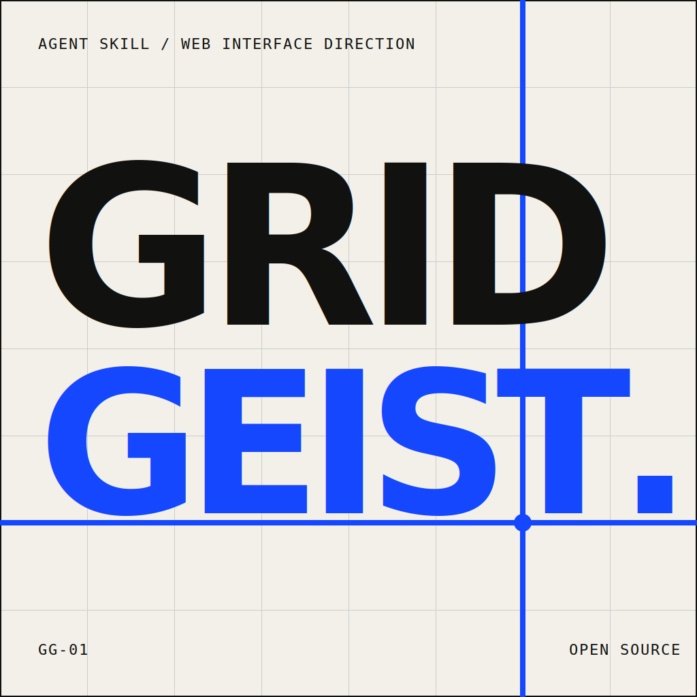
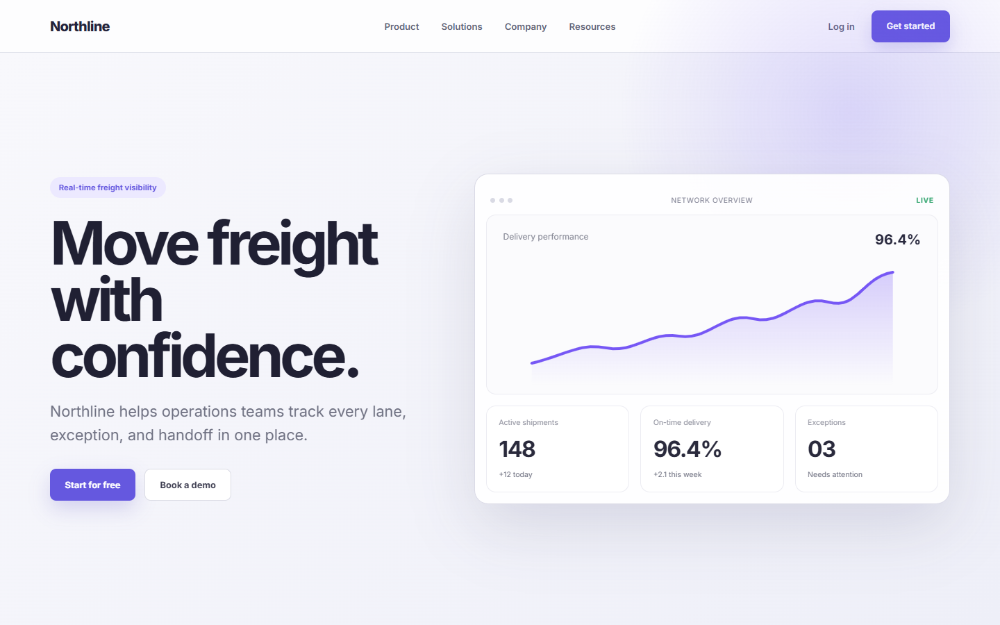
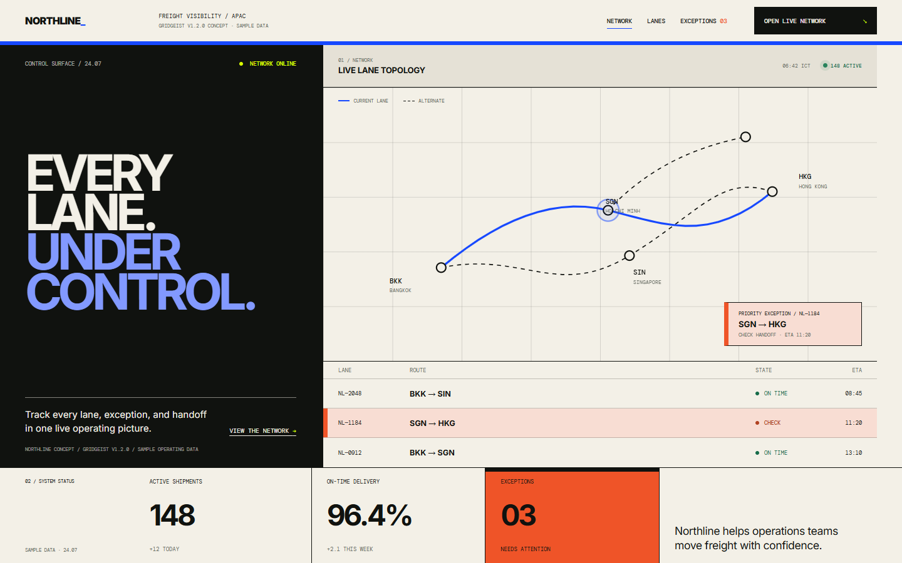

<p align="center">
  
</p>

# Gridgeist — คู่มือภาษาไทย

[English](README.md) · **ภาษาไทย** · [เว็บไซต์](https://ohmiler.github.io/gridgeist/th/) · [ตัวอย่าง](https://ohmiler.github.io/gridgeist/examples/)

Gridgeist คือ Agent Skill สำหรับสร้าง ปรับดีไซน์ และรีวิวหน้าเว็บที่มีระบบเฉพาะกับผลิตภัณฑ์ โดยปรับ Structure, Typography, Imagery, Interaction และหลักฐานจากผลิตภัณฑ์ให้เข้ากับแบรนด์ ใช้ Grid เป็นตรรกะที่มองเห็นได้ เบาบาง หรือซ่อนอยู่เบื้องหลัง ช่วยลดหน้าตาแบบ Generic AI SaaS โดยยังรักษาแบรนด์ ฟังก์ชัน Responsive behavior และ Accessibility

## เห็นความต่างได้ทันที

ตัวอย่าง Northline Logistics นี้สร้างจากหน้า HTML/CSS แบบเต็มสองเวอร์ชัน โดยใช้ผลิตภัณฑ์ เนื้อหา ข้อมูลปฏิบัติการตัวอย่าง และขนาดหน้าจอชุดเดียวกัน หน้าและภาพ After ถูกสร้างใหม่ด้วย Workflow แบบเป็นระบบของ **Gridgeist v1.2.0** โดย Northline และข้อมูลทั้งหมดเป็นเรื่องสมมติ

<table>
  <tr>
    <th width='50%'>ไม่ใช้ Gridgeist - Generic SaaS</th>
    <th width='50%'>ใช้ Gridgeist v1.2.0 - ระบบที่สะท้อนผลิตภัณฑ์</th>
  </tr>
  <tr>
    <td></td>
    <td></td>
  </tr>
</table>

เนื้อหาและข้อมูลปฏิบัติการตัวอย่างเหมือนเดิม แต่ใช้ระบบการออกแบบต่างกัน Gridgeist ทำให้ topology, ตารางเส้นทาง, exception, action และ metrics เชื่อมเป็นพื้นผิวปฏิบัติการเดียวที่สร้างจากหลักฐานของผลิตภัณฑ์ พร้อมระบุชัดว่าเป็น concept ภาพทั้งสองใน README เป็นภาพที่ capture จากหน้าเว็บจริง [เปิดหน้า Before](https://ohmiler.github.io/gridgeist/readme-showcase/?view=before) หรือ [เปิดหน้า After ของ v1.2.0](https://ohmiler.github.io/gridgeist/readme-showcase/?view=after&rev=ab77ceb6)

## v1.2.0 เปลี่ยนอะไรบ้าง

Gridgeist มองการตัดสินใจด้านภาพเป็นระบบเดียว ไม่ใช่ชุดการตกแต่งที่แยกจากกันทีละส่วน

| ด้าน | พฤติกรรมใน v1.2.0 |
| --- | --- |
| System contract | กำหนดสี Typography, Layout, Spacing, Shape, Components, States, Media และ Motion เป็นทิศทางย่อชุดเดียวก่อนลงมือ |
| Semantic roles | เชื่อม Foundation tokens ไปยัง Semantic roles และการตัดสินใจระดับ Component ทำให้ Contrast และความสัมพันธ์ของสถานะมีเจตนาชัดเจน |
| Component grammar | กำหนด Anatomy, Variants, Density, States และกติกาเมื่อเนื้อหายาวให้ Component ที่เกี่ยวข้อง แทนการแต่งแต่ละจุดแยกกัน |
| Direction safety | เมื่อแนวคิดภาพยังกว้าง จะเสนอทิศทางที่ต่างกันอย่างชัดเจนและรอให้เลือกก่อนกำหนด Tokens หรือแก้ Interface |
| Skill coordination | ระบุผู้รับผิดชอบทิศทางเพียงหนึ่งตัวเมื่อใช้หลาย UI Skills เพื่อไม่ให้เกิดระบบภาพที่แข่งขันกัน |
| Verification | ตรวจหลายความกว้าง, Overflow, Focus, Interaction states, Themes และ Reduced motion พร้อมจำกัดคำกล่าวอ้างตามหลักฐานที่สังเกตได้ |

ผลลัพธ์คือ Interface ที่เป็นเนื้อเดียวกันมากขึ้น ดู Generic น้อยลง และต่อยอดได้ง่ายโดยไม่ทำให้เอกลักษณ์ผลิตภัณฑ์หายไป การทดสอบ v1.2.0 ครอบคลุม System-contract scenarios ภาษาอังกฤษ 3 รอบและภาษาไทย 3 รอบ, การตรวจ Responsive ด้วย Browser แบบอิสระ และ Guardrail tests ที่ซ่อมแล้ว

## เริ่มใช้ใน 60 วินาที

1. ติดตั้ง Gridgeist ผ่านช่องทางหลักของ Agent ที่ใช้งาน

   สำหรับ Codex ให้เพิ่ม Git Marketplace แล้วติดตั้ง Plugin:

   ```powershell
   codex plugin marketplace add ohmiler/gridgeist
   codex plugin add gridgeist@gridgeist
   ```

   สำหรับ Claude Code, Cursor, Gemini CLI, GitHub Copilot, OpenCode และ Agent อื่นที่รองรับ ให้ใช้ตัวติดตั้งแบบ Universal:

   ```powershell
   npx skills add ohmiler/gridgeist -g
   ```

   **วิธีสำรอง:** หากใช้ตัวติดตั้งทั้งสองแบบไม่ได้ ให้ไปที่ [ติดตั้งด้วยตนเอง](#ติดตั้งด้วยตนเอง)
2. เปิด Agent session ใหม่ในโปรเจกต์เว็บของคุณ แล้ววาง Prompt นี้:

   ```text
   ใช้ Skill Gridgeist รีวิว Interface นี้โดยยังไม่ต้องแก้โค้ด
   สรุปคำตัดสินหนึ่งบรรทัด ตามด้วยปัญหาที่เรียงตามความสำคัญพร้อมหลักฐาน
   และเสนอทิศทาง Redesign ที่สอดคล้องกันหนึ่งทิศทาง โดยรักษาฟังก์ชันและแบรนด์เดิม
   ```

Agent ที่รองรับการเรียก Skill แบบตรงตัวสามารถใช้ `$gridgeist` ใน Prompt ได้ ดูรายละเอียดเฉพาะผลิตภัณฑ์และตัวอย่างเพิ่มเติมที่ [การติดตั้ง](#การติดตั้ง)

## เหมาะกับงานแบบไหน

- Landing page, Dashboard, Documentation, Portfolio และ Learning platform
- ปรับดีไซน์หน้าเว็บเดิมโดยไม่ทำให้ฟังก์ชันหรือแบรนด์เสีย
- รีวิว Draft และจัดลำดับปัญหาด้าน Hierarchy, Composition, Responsive และ Accessibility
- งานที่ต้องการทิศทางแบบ Technical, Editorial, Image-led, Playful, Utilitarian หรือ Visible grid โดยไม่ทำให้เอกลักษณ์แบรนด์หายไป

## การติดตั้ง

### Codex Plugin

Repository นี้เตรียมเป็น Codex Plugin ผ่าน [`.codex-plugin/plugin.json`](.codex-plugin/plugin.json) โดย Plugin ชี้ไปยังโฟลเดอร์ `skills/gridgeist/` ชุดเดียวกับช่องทางอื่น ทำให้ทุกวิธีติดตั้งใช้แหล่งข้อมูลเดียวกัน

เพิ่ม Gridgeist Marketplace แล้วติดตั้ง Plugin ด้วยคำสั่ง:

```powershell
codex plugin marketplace add ohmiler/gridgeist
codex plugin add gridgeist@gridgeist
```

หลังติดตั้งให้เปิด Codex session ใหม่ เพื่อให้ระบบตรวจพบ Skill ที่อยู่ใน Plugin

### ตัวติดตั้งแบบ Universal

สำหรับ Claude Code, Cursor, Gemini CLI, GitHub Copilot, OpenCode และ Agent อื่นที่รองรับ ใช้ [open agent skills CLI](https://github.com/vercel-labs/skills) ติดตั้ง Gridgeist ได้ด้วยคำสั่งเดียว:

```powershell
npx skills add ohmiler/gridgeist -g
```

ตัวติดตั้งจะค้นพบ `skills/gridgeist/` และให้เลือก Agent เป้าหมาย หากต้องการระบุ Agent โดยตรง ให้ส่งชื่อ Agent เช่น:

```powershell
npx skills add ohmiler/gridgeist -g -a claude-code
```

### ติดตั้งด้วยตนเอง

ใช้การคัดลอกด้วยตนเองเมื่อไม่สามารถใช้ Plugin หรือตัวติดตั้งแบบ Universal ได้:

```powershell
git clone https://github.com/ohmiler/gridgeist.git
Copy-Item -Recurse .\gridgeist\skills\gridgeist "$HOME\.agents\skills\gridgeist"
```

สำหรับ Agent อื่น ให้คัดลอก `skills/gridgeist/` ไปยัง Skills directory ของผลิตภัณฑ์นั้น Agent ต้องรองรับมาตรฐาน Agent Skills `SKILL.md` และการตรวจพบหรือวิธีเรียกใช้อาจแตกต่างกัน หลังคัดลอกแล้วให้เปิด Agent session ใหม่

## การอัปเดต

Gridgeist จะไม่อัปเดตแบบเงียบในเบื้องหลัง ให้ใช้คำสั่งตามช่องทางที่ติดตั้ง แล้วเริ่ม Agent session ใหม่

### Codex Plugin

ดึง Git-backed marketplace snapshot ล่าสุด แล้วติดตั้ง Plugin version ที่ Release นั้นประกาศอีกครั้ง:

```powershell
codex plugin marketplace upgrade gridgeist
codex plugin add gridgeist@gridgeist
```

ตรวจเวอร์ชันที่ติดตั้งด้วย `codex plugin list` หาก Session ปัจจุบันยังใช้คำสั่งเดิม ให้เปิด Thread ใหม่หรือ Restart Codex app

### Universal installer

อัปเดต Gridgeist ที่ติดตั้งระดับผู้ใช้:

```powershell
npx skills update gridgeist -g -y
```

หากติดตั้งระดับโปรเจกต์ ให้ใช้ `npx skills update gridgeist -p -y`

### Git clone หรือคัดลอกเอง

รัน `git pull --ff-only` ใน Repository ที่ Clone ไว้ แล้วติดตั้งจาก `skills/gridgeist/` อีกครั้ง การคัดลอกเองไม่มีข้อมูล Source หรือ Version จึงต้องแทนที่โฟลเดอร์ Skill ทั้งชุดจาก Release tag แนะนำให้ใช้ Codex Plugin หรือ Universal installer หากต้องการอัปเดตในอนาคต

## วิธีเรียกใช้

เรียกใช้โดยตรงด้วย `$gridgeist` แล้วระบุ 4 อย่าง:

1. ผลิตภัณฑ์และกลุ่มผู้ใช้
2. งานที่ต้องการ: สร้างใหม่ ปรับดีไซน์ หรือรีวิว
3. สิ่งที่ต้องรักษา เช่น ฟังก์ชัน สีแบรนด์ หรือเนื้อหา
4. สิ่งที่ต้องตรวจ เช่น Desktop, Mobile, Keyboard และ Accessibility

### Create — สร้างหน้าใหม่

```text
ใช้ $gridgeist ออกแบบ Landing Page สำหรับแพลตฟอร์มเรียน SQL
ให้บทเรียน Query editor และผลลัพธ์เป็นส่วนสำคัญของงานภาพ
หลีกเลี่ยงการ์ด SaaS แบบทั่วไป และตรวจทั้ง Desktop กับ Mobile
```

### Redesign — ปรับดีไซน์เดิม

```text
ใช้ $gridgeist ปรับดีไซน์ Dashboard นี้ใหม่
รักษาฟังก์ชัน เส้นทาง เนื้อหา และสีแบรนด์เดิมทั้งหมด
จัดลำดับข้อมูลตามความสำคัญ และอย่าแก้เพียงแค่ลดความโค้งของการ์ด
```

### Review — รีวิวโดยยังไม่แก้โค้ด

```text
รีวิวหน้าเว็บนี้ด้วย $gridgeist โดยยังไม่ต้องแก้โค้ด
สรุปคำตัดสินหนึ่งบรรทัด ตามด้วยปัญหาที่เรียงตามความสำคัญ
หลักฐาน และทิศทางใหม่ที่สอดคล้องกัน
```

### บรีฟอย่างไรให้ผลลัพธ์ตรงใจ

หากต้องการผลลัพธ์ที่แม่นขึ้น ให้ระบุรายละเอียดเหล่านี้เท่าที่เกี่ยวข้อง:

- **ผลิตภัณฑ์และผู้ใช้** — เว็บทำอะไรและใครเป็นคนใช้
- **Primary task** — สิ่งสำคัญที่สุดที่ผู้ใช้ต้องทำให้สำเร็จ
- **ทิศทางภาพ** — บุคลิกที่ต้องการ เช่น Warm editorial, Precise technical หรือ
  Playful tactile
- **ของจริงจากผลิตภัณฑ์** — Product UI, ข้อมูล, เนื้อหา, ภาพ, Artwork, Code หรือ
  Workflow ที่ควรเป็นพระเอก
- **สิ่งที่ต้องรักษา** — แบรนด์ เนื้อหา Route พฤติกรรม Component ความเป็นส่วนตัว
  หรือข้อจำกัดของ Platform
- **สิ่งที่ไม่ต้องการ** — ภาษาภาพหรือพฤติกรรมที่ไม่เหมาะกับผลิตภัณฑ์
- **Flow และสถานะ** — Default, Loading, Empty, Error, Success, Disabled และ
  Destructive ที่สำคัญ
- **การตรวจผล** — Viewport, Keyboard, Touch, Focus, Overflow, Reduced motion และ
  Primary flow ที่ต้องทดสอบ

หากทิศทางชัดแล้ว ให้บอกทิศทางนั้นและให้ Gridgeist ทำต่อโดยไม่ต้องถามรสนิยมซ้ำ
หากยังมีหลายทิศทางที่เป็นไปได้จริง ให้สั่ง Gridgeist ตรวจของเดิมก่อน เสนอ 2–3
ทิศทางพร้อมข้อแลกเปลี่ยนและคำแนะนำ แล้วรอให้เลือกก่อนแก้โค้ด

คัดลอก Template นี้ไปปรับใช้ได้เลย:

```text
ใช้ $gridgeist เพื่อ [สร้างใหม่ / ปรับดีไซน์ / รีวิว] [หน้าเว็บหรือผลิตภัณฑ์]

ผลิตภัณฑ์และผู้ใช้:
[เว็บทำอะไรและใครเป็นคนใช้]

Primary task:
[ผลลัพธ์สำคัญที่สุดที่ผู้ใช้ต้องทำให้สำเร็จ]

ทิศทางภาพ:
[ทิศทางที่ยืนยันแล้ว หรือ: ตรวจของเดิมก่อน เสนอ 2–3 ทิศทางพร้อมข้อแลกเปลี่ยน
และคำแนะนำ และยังไม่ต้องแก้โค้ดจนกว่าผมจะเลือก]

สิ่งที่ควรเป็นพระเอก:
[Product UI / ข้อมูล / เนื้อหา / ภาพ / Artwork / Code / Workflow]

ต้องรักษา:
[แบรนด์ เนื้อหา Route พฤติกรรม Component และข้อจำกัด]

ไม่ต้องการ:
[ภาษาภาพหรือพฤติกรรมที่ไม่เหมาะ]

Flow และสถานะสำคัญ:
[Primary flow และ Default/Loading/Empty/Error/Success/Disabled ที่เกี่ยวข้อง]

ให้ตรวจ:
[Viewport, Keyboard, Touch, Focus, Overflow, Reduced motion และ Primary flow]

ตรวจ Repository และหน้าเว็บที่ Render จริงก่อนเริ่มทำงาน
```

ควรบอกผลลัพธ์และข้อจำกัดที่มีเหตุผล แทนการสั่ง CSS ทีละค่า หากไม่ได้เป็นข้อกำหนด
ของแบรนด์ ให้ Gridgeist กำหนดขนาดตัวอักษร Spacing, Radius, Shadow และจำนวนคอลัมน์
เป็นระบบเดียวกันจากผลิตภัณฑ์และทิศทางที่เลือก

หากโปรเจกต์มี `DESIGN.md`, Theme, Token set หรือ Component library อยู่แล้ว
Gridgeist จะตรวจสิ่งเหล่านี้ร่วมกับ Implementation และ Interface ที่ Render จริง
แทนการสมมติว่าทุกแหล่งสอดคล้องกัน `DESIGN.md` เป็นช่องทางเชื่อมต่อแบบเลือกใช้
ไม่ใช่ Dependency โดย Gridgeist ไม่ควรสร้างหรือแก้ไฟล์นี้ เว้นแต่คุณขอ
Design-system artifact ที่นำไปใช้ต่อได้ หรือระบุให้งานรวมเอกสารระบบที่ต้องเก็บถาวร
อย่างชัดเจน

## ใช้ร่วมกับ Skill อื่น

Gridgeist ทำงานได้ดีที่สุดเมื่อเป็นผู้กำหนดทิศทางผลิตภัณฑ์และงานภาพเพียง Skill เดียว ส่วน Skill อื่นควรเข้ามาเสริมเฉพาะการส่ง Context การตรวจเชิงเทคนิค หรือการยืนยันผลจากหน้าเว็บที่ Render แล้ว สำหรับโปรเจกต์ส่วนใหญ่ แนะนำ workflow ที่เบาที่สุดดังนี้:

```text
Gridgeist -> Playwright
```

Gridgeist กำหนด Interface thesis, ลำดับชั้น, ระบบภาพ และทิศทางการ Implement จากนั้น Playwright ตรวจผลที่ Render จริงในขนาดหน้าจอและ Interaction ที่สำคัญ รวมถึงทำ [Visual comparison](https://playwright.dev/docs/test-snapshots) แบบทำซ้ำได้

| ลักษณะงาน | Workflow ที่แนะนำ | การแบ่งหน้าที่ |
| --- | --- | --- |
| โปรเจกต์เว็บทั่วไป | `Gridgeist -> Playwright` | ออกแบบและ Implement แล้วตรวจผลที่ Render จริง |
| ใช้ Figma เป็น Source of truth | `Figma -> Gridgeist -> Playwright` | ดึง Component, Variable และ Layout context; ปรับให้เข้ากับผลิตภัณฑ์และ Codebase; แล้วตรวจผล ดูรายละเอียดที่ [Figma MCP server](https://developers.figma.com/docs/figma-mcp-server/) |
| React หรือ Next.js | `Gridgeist -> Vercel React Best Practices -> Playwright` | กำหนดทิศทาง Interface; ตรวจ Performance ตาม Framework; แล้วยืนยัน Behavior ดู [Vercel Agent Skills](https://github.com/vercel-labs/agent-skills) |
| ตรวจคุณภาพก่อน Release | `Gridgeist -> Web Quality Audit -> Playwright` | ตรวจลำดับชั้นและความเข้ากับแบรนด์; Audit ด้าน Accessibility, Performance, SEO และ Web quality; แล้วยืนยันหน้าเว็บจริง ดู [Web Quality Skills](https://github.com/addyosmani/web-quality-skills) |
| ต้องสร้างภาพต้นฉบับใหม่ | `Gridgeist -> สร้างภาพ -> Gridgeist -> Playwright` | กำหนด Thesis ก่อนสร้าง Asset; นำภาพที่เลือกมาจัดองค์ประกอบ; แล้วตรวจ Interface |

ทั้งหมดนี้เป็น workflow เสริม ไม่ใช่ Dependency ให้เพิ่มเฉพาะ Skill ที่ตอบโจทย์จริง และไม่ควรใช้ Frontend-design หรือ Art-direction skill แบบกว้างอีกตัวในช่วงออกแบบเดียวกัน เพราะทิศทางภาพที่แข่งขันกันอาจทำให้ผลลัพธ์ไม่เป็นระบบ ชื่อและความพร้อมใช้งานของ Skill เสริมอาจต่างกันในแต่ละ Agent

ตัวอย่าง:

```text
ใช้ $gridgeist ปรับดีไซน์ Interface นี้โดยรักษาพฤติกรรมและแบรนด์เดิม
หลัง Implement ให้ใช้ Playwright ตรวจ Desktop และ Mobile viewport ที่สำคัญ
การใช้งานด้วย Keyboard, Overflow และ Primary user flow
```

## ทำอย่างไรให้ผลลัพธ์ดีขึ้น

- ให้ Agent ดู Repository และหน้าเว็บที่ Render แล้ว ไม่ใช่แค่คำอธิบาย
- ระบุพฤติกรรมที่ห้ามเปลี่ยนเมื่อทำ Redesign
- ใช้เนื้อหา ข้อมูล โค้ด หรือ Workflow ของผลิตภัณฑ์จริง
- ให้ตรวจหลาย Viewport และสถานะ Interaction
- บอกแบรนด์ที่ต้องรักษา เพื่อไม่ให้ Swiss aesthetic กลายเป็น Preset

## กรณีศึกษา

[Tracefield](https://ohmiler.github.io/tracefield/) คือ Developer Observability Dashboard ที่ใช้ Gridgeist กับโปรเจกต์จริง โดย [Repository](https://github.com/ohmiler/tracefield) เก็บ Baseline, Prompt ที่ใช้, Rubric ประเมินผล, ชุดทดสอบ และ Final interface ไว้ให้ตรวจสอบได้

[Ledgerline](https://ohmiler.github.io/ledgerline/) ทดสอบ Skill เดียวกันกับเว็บไซต์เอกสาร Payment API ที่มีเนื้อหาหนาแน่น โดย [Repository](https://github.com/ohmiler/ledgerline) เก็บ Baseline, Prompt แบบตรงตัว, Rubric 6 ด้าน, เนื้อหา API ที่กำหนดตายตัว, การตรวจ 4 ขนาดหน้าจอ และ Final interface ไว้ครบ

[Morrow](https://ohmiler.github.io/morrow-portfolio/) ทดสอบการปรับตัวตามแบรนด์ด้วย Creative Portfolio แบบ Image-led ที่เป็น Fictional โดย [Repository](https://github.com/ohmiler/morrow-portfolio) เก็บภาพ AI-generated ชุดเดียวกัน, Baseline, Prompt แบบตรงตัว, Rubric 6 ด้าน, การตรวจ 4 ขนาดหน้าจอ และ Final interface ที่ตั้งใจไม่ใช้ภาษาภาพแบบ Technical ของกรณีศึกษาก่อนหน้า

[Doodlewood](https://ohmiler.github.io/doodlewood/) ทดสอบ Playful interaction design ด้วยสตูดิโอวาดรูปสำหรับเด็กแบบ Fictional ที่รักษาความเป็นส่วนตัว โดย [Repository](https://github.com/ohmiler/doodlewood) เก็บ Baseline, Prompt แบบตรงตัว, Rubric 6 ด้าน, Drawing engine ที่ทำงานในเครื่อง, การตรวจ 4 ขนาดหน้าจอ และข้อจำกัดด้านความปลอดภัยของเด็กกับหลักฐานจากผู้ใช้จริงไว้อย่างชัดเจน

กรณีศึกษาที่ทีมสร้างเองทั้ง 4 ตัวจึงครอบคลุมพื้นผิวแบบ Data-heavy, Content-heavy, Image-led และ Playful interactive แล้ว ขั้นต่อไปควรเน้นการตรวจจากผู้ใช้ Agent และโปรเจกต์ภายนอก มากกว่าการเพิ่มหมวดภาพที่ทีมสร้างเองอีก

## ข้อจำกัด

- Gridgeist ให้ทิศทางและกระบวนการ แต่คุณภาพยังขึ้นกับ Context ที่ Agent ได้รับ
- Automated checks ไม่สามารถแทนการตรวจหน้าเว็บจริงได้
- ค่าเริ่มต้นด้าน Grid, Type และสีเป็นเพียงจุดเริ่มต้น ไม่ใช่กฎตายตัว
- ผลลัพธ์จากโมเดลไม่แน่นอน ควรทดสอบซ้ำเมื่อเปลี่ยน Agent หรือแก้ Skill

## การทดสอบ

ชุด Prompt และเกณฑ์ประเมินภาษาไทยอยู่ที่ [`evals/prompts.th.md`](evals/prompts.th.md) ส่วนชุดภาษาอังกฤษอยู่ที่ [`evals/prompts.md`](evals/prompts.md)

ตรวจโครงสร้าง Skill ที่ติดตั้งได้ โดยบังคับ Python ให้อ่าน UTF-8:

```powershell
python -X utf8 "$HOME\.codex\skills\.system\skill-creator\scripts\quick_validate.py" .\skills\gridgeist
```

ตรวจ Release metadata และเอกสารสองภาษาโดยไม่ต้องใช้ Dependency ภายนอก:

```powershell
python -X utf8 .\scripts\validate_release.py
```

ทดสอบ Clean install และ Update ผ่าน Codex Marketplace กับตัวติดตั้งแบบ Universal จริง คำสั่งนี้ต้องใช้ Codex, Node.js, npm, Git และ Network โดยจะใช้ Home ชั่วคราวและไม่แก้การติดตั้งเดิมของคุณ:

```powershell
python -X utf8 .\scripts\smoke_test_install.py
```

## License

[MIT](LICENSE)
